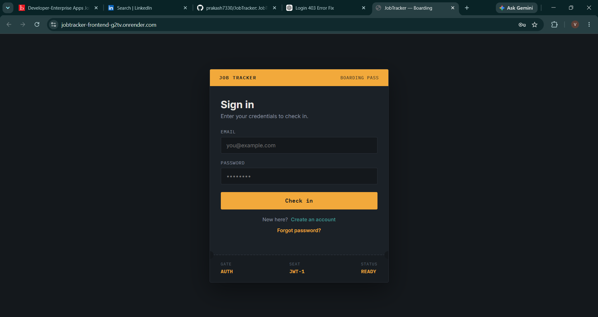
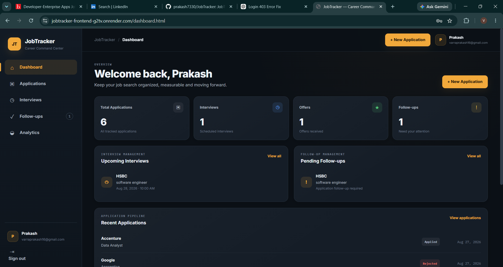
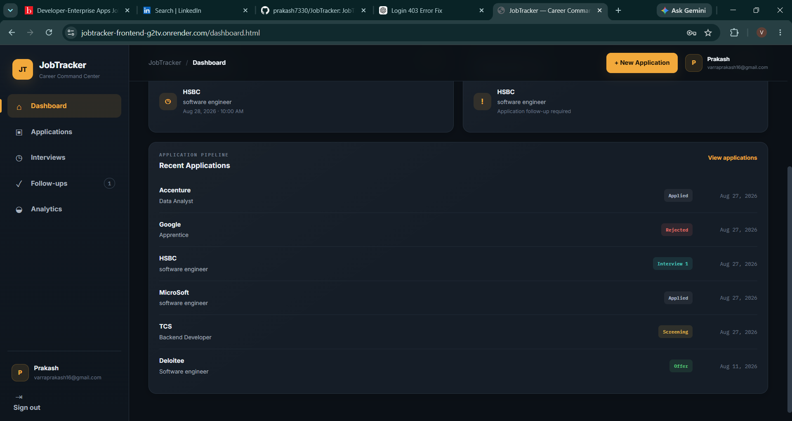
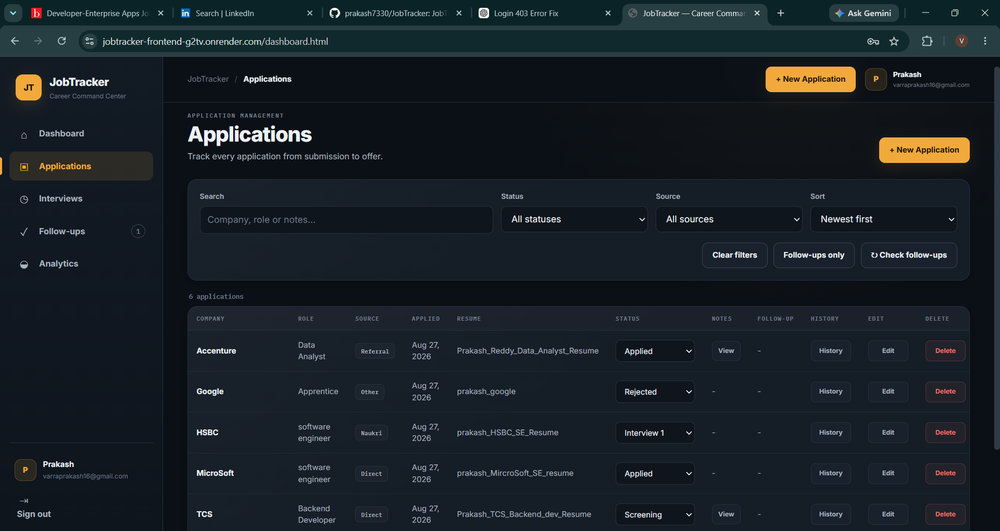
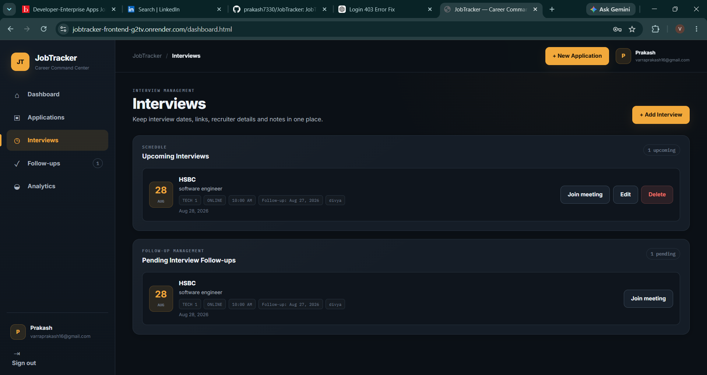
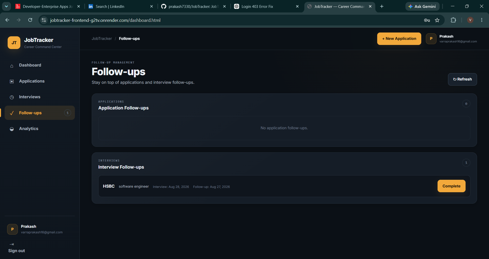
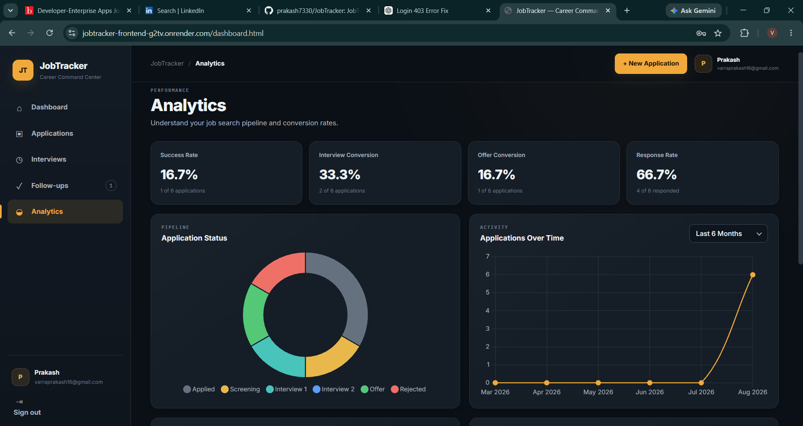

# JobTracker

## Job Application Tracking System

JobTracker is a full-stack web application designed to help job seekers organize and manage their job search in one place.

It allows users to track job applications, monitor application statuses, manage interviews, set follow-ups, and understand their job search performance through analytics.

---

## 📌 Overview

Managing multiple job applications can become difficult when application details, interview dates, recruiter information, and follow-ups are stored in different places.

JobTracker provides a centralized platform where users can:

- Track job applications
- Manage application statuses
- Store resume information
- Record interview details
- Manage application and interview follow-ups
- View job search analytics
- Monitor application progress
- Keep important job-search information organized

---

## ✨ Features

### 🔐 User Authentication

- User registration
- User login
- Secure authentication
- Forgot password functionality
- Password reset functionality
- User-specific application data

### 📋 Application Management

Users can create and manage job applications with information such as:

- Company name
- Job role
- Application source
- Application date
- Resume used
- Current application status
- Notes
- Follow-up information
- Application history

Supported application statuses include:

- Applied
- Screening
- Interview 1
- Interview 2
- Offer
- Rejected

### 📅 Interview Management

Users can manage upcoming interviews and store:

- Company
- Job role
- Interview date
- Interview time
- Interview type
- Meeting link
- Recruiter details
- Follow-up date

### 🔔 Follow-up Management

JobTracker helps users remember important follow-ups related to:

- Job applications
- Interviews
- Recruiters

Users can view pending follow-ups and mark completed follow-ups.

### 📊 Analytics Dashboard

The analytics section provides an overview of the job search pipeline, including:

- Success rate
- Interview conversion rate
- Offer conversion rate
- Response rate
- Application status distribution
- Applications over time

---

# 🖥️ Application Screenshots

## 🔐 Login

The login page allows users to securely access their JobTracker account.



---

## 📊 Dashboard

The dashboard provides a quick overview of the user's job search activity, including applications, interviews, offers, and pending follow-ups.



---

## 📋 Dashboard - Recent Applications

The dashboard also provides a quick view of recently tracked job applications and their current statuses.



---

## 🗂️ Applications

The Applications page allows users to manage and filter their complete job application pipeline.

Users can search applications and filter them by:

- Status
- Source
- Follow-ups
- Application date



---

## 📅 Interviews

The Interviews section allows users to manage upcoming interviews and keep important interview information in one place.



---

## 🔔 Follow-ups

The Follow-ups section helps users keep track of pending application and interview follow-ups.



---

## 📈 Analytics

The Analytics dashboard provides insights into the overall job search pipeline and conversion rates.



---

# 🏗️ Application Architecture

```text
                         ┌──────────────────────┐
                         │      User / Browser  │
                         └──────────┬───────────┘
                                    │
                                    ▼
                         ┌──────────────────────┐
                         │       Frontend       │
                         │   HTML/CSS/JS        │
                         └──────────┬───────────┘
                                    │
                              REST API / JWT
                                    │
                                    ▼
                         ┌──────────────────────┐
                         │      Spring Boot     │
                         │       Backend        │
                         ├──────────────────────┤
                         │ Spring Security      │
                         │ JWT Authentication   │
                         │ Spring Data JPA      │
                         │ Hibernate             │
                         │ Follow-up Scheduler  │
                         └───────┬───────┬──────┘
                                 │       │
                     ┌───────────┘       └─────────────┐
                     ▼                                 ▼
          ┌──────────────────┐               ┌──────────────────┐
          │    PostgreSQL    │               │   Gmail SMTP     │
          │     Supabase     │               │ Password Reset   │
          └──────────────────┘               └──────────────────┘
